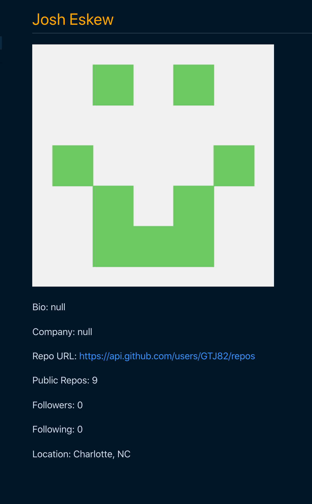

# GTJ82.github.io-Develper_Profile_Generator

## Description:

This program is a great tool for anyone to generate a user profile based on
ther Github profile. The user will be promapted to answer a few questions. First, it will ask them for
their Github username. Second, will ask them for their favorite color. The user input will be enough to
generate a very functional Developer profile that can be used for a wide variety of reasons.

## Future add-ons:

You could add a number of extra features to this program. Based on the the same user input given we 
could call to provide much more data depending on the needs of management or whoever was creating the
profiles.

## Link:

[Developer-Profile-Generator](https://github.com/GTJ82/GTJ82.github.io-Develper_Profile_Generator)

## Images of rendered profile

